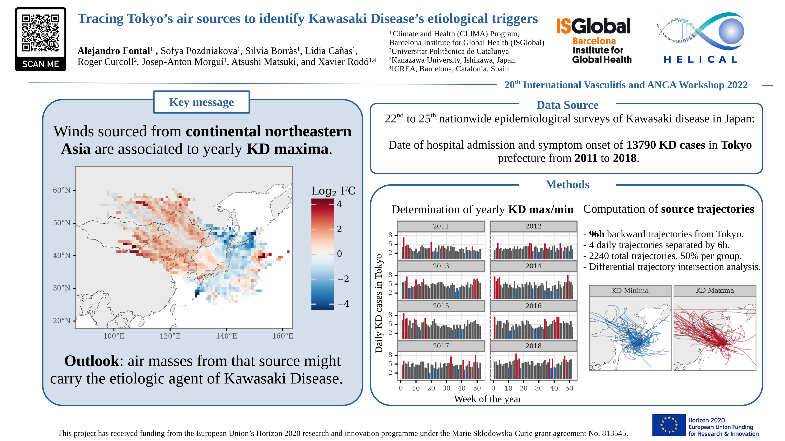

[](https://alfontal.github.io/vasculiti22-conference/)
# Tracing Tokyo's air sources to identify Kawasaki Disease's etiological triggers


This repository acts as a centralized place where to provide reproducible code for the analysis displayed in the 20th International Vasculitis and ANCA workshop in the study titled  *Tracing Tokyo's air sources to identify Kawasaki Disease's etiological triggers*:




## Report and code

The [Github pages site](https://alfontal.github.io/bioaerosol-reports) renders the reports and code nicely for a more thorough explanation of the whole project.

## Reproducing the analysis

### Python

This project uses `poetry` to manage Python dependencies. You will need to have Python 3.8 installed in your machine. 

If you don't have `poetry` in your system, you can easily install it via `pip`:

```
pip install poetry
```
Then, to generate a specific environment for this project and install the dependencies defined in the `pyproject.toml` file, just:

```
poetry install
```


### HYSPLIT

To estimate the backtrajectories of air sources, in this study we use [HYSPLIT 5](https://www.ready.noaa.gov/HYSPLIT.php). You will need a local installation of the last version of HYSPLIT in order to be able to run the model yourself. Check the documentation on the provided link to be able to perform the installation on your local machine. 

#### Meteorology data

You will also need to download the associated gridded meteorology data in order to be able tu run HYSPLIT. In this case, the data used is GDAS 1x1 data, from 2011 to 2018. This is not included in the repository as it contains several GB of information. This data is available for download via the NOAA's archives FTP, accessible through this link: https://www.ready.noaa.gov/archives.php.
